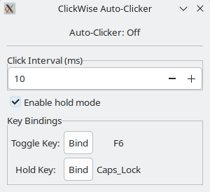

# ClickWise

ClickWise is a minimalistic auto-clicker for Linux with a compact GTK interface.  
It provides just the essential features you need — no clutter.

## Features
- **Toggle Key** — start/stop auto-clicking with a hotkey.
- **Hold Key** — press and hold a key to enable clicking.
- **Enable Hold Mode** — Enable hold behavior.
- **Click Interval (ms)** — adjust the click speed.

## License
This project is licensed under the MIT License. See [LICENSE](LICENSE) for details.
